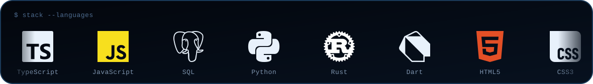
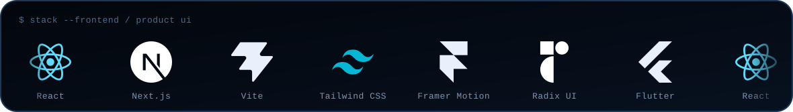
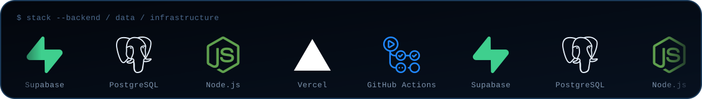
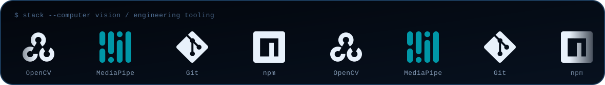
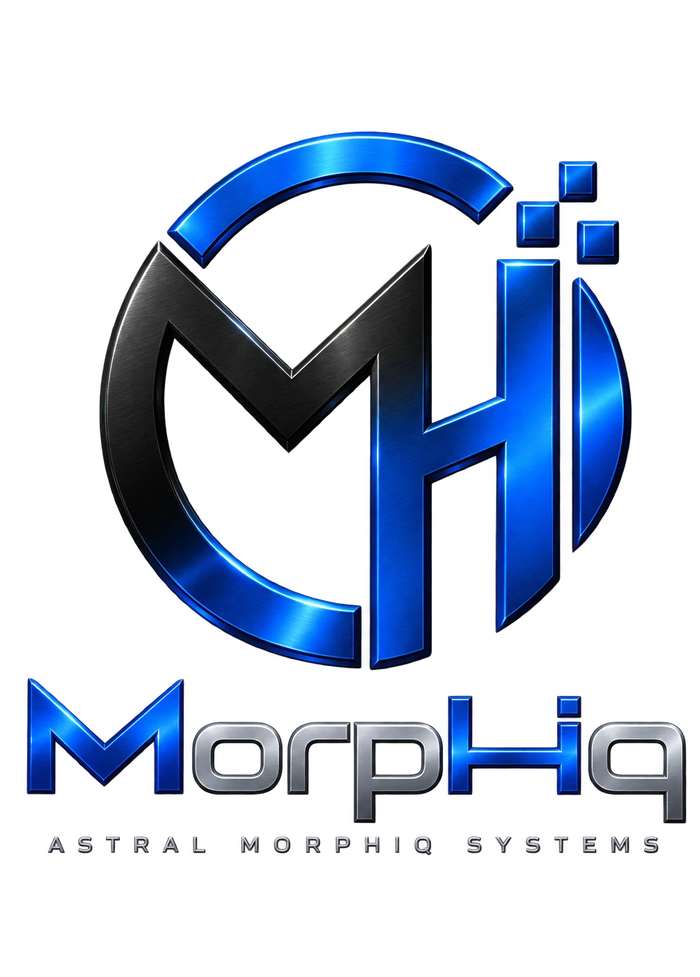

<div align="center">



</div>

## `> stack --all`










<table>
<tr>
<td width="40%" valign="middle">



</td>
<td width="60%" valign="middle">

# Miguel Huerta · `M1gu3hb`

### Product Systems Builder · Full-Stack Development · UI Architecture · Production Engineering

[](https://morphiq.com.mx)
[](https://github.com/M1gu3hb)
[](https://github.com/M1gu3hb?tab=repositories)

</td>
</tr>
</table>


## `> whoami`

I build **real software systems for real operations**: product interfaces, POS platforms, admin panels, client portals, CMS/CRM-style workflows, dashboards, automation, computer-vision utilities, and experimental cross-platform products.

My focus is not just making a screen look good. I care about the full path from **business logic → data model → permissions → interface → testing → deployment → production hardening**.

I am currently building under **Morphiq / Astral Morphiq Systems**, with a strong focus on tactile high-fidelity UI, operational software, reliable architecture and production-ready systems.

```text
problem
   ↓
domain + workflow model
   ↓
data / auth / permissions
   ↓
product architecture
   ↓
UI + interaction system
   ↓
tests / hardening / deployment
   ↓
production
```


## `> specialization --verbose`

| Area | What I work on |
|---|---|
| **Product systems** | POS, operational dashboards, admin panels, customer portals, quoting, contracts, inventory and internal tools |
| **Frontend engineering** | React, Next.js, Vite, responsive systems, advanced interaction, motion, accessibility and high-fidelity UI |
| **Backend + data** | PostgreSQL, Supabase, Auth, RLS, migrations, RPCs, serverless APIs and secure data boundaries |
| **UI architecture** | Design systems, tactile interfaces, glass / clay / skeuomorphic material systems, component libraries and visual editors |
| **Production hardening** | Permissions, rate limits, validation, CSP/security headers, database policies, failure handling and deployment discipline |
| **Engineering workflow** | Architecture planning, implementation review, audits, context documentation, regression control and QA loops |
| **Native / systems experiments** | Rust cores, Dart/Flutter bridges, Python computer vision, Windows tooling and cross-platform prototypes |


## `> projects --featured`

<table>
<tr>
<td width="50%" valign="top">

### 🧬 [Morphiq UI](https://github.com/M1gu3hb/Morphiq-UI)

A tactile React component library and visual component studio focused on **Clay, Glass, Skeuomorphic and adaptive material systems**.

`Next.js 16` · `React 19` · `TypeScript` · `Tailwind 4` · `Motion`

**Built around:** editable component systems, vector/mask tools, variants, responsive layout, 3D transforms, interaction timelines and code export.

</td>
<td width="50%" valign="top">

### ⚡ [Qyro](https://github.com/M1gu3hb/-Qyro)

Cross-platform experiment for **private, direct file transfer** without accounts, cloud storage, ads, telemetry or a centralized backend.

`Rust` · `Dart` · `Flutter` · `FFI` · `Android` · `iOS` · `Windows`

**Current engineering:** shared Rust core, native FFI, platform builds, CI and deterministic boot architecture.

</td>
</tr>
<tr>
<td width="50%" valign="top">

### 🏇 [Jardines Club Hípico](https://github.com/M1gu3hb/jardines-club-hipico)

Production event platform with a public site, administration workflows and customer portal.

`React` · `Vite` · `Supabase` · `PostgreSQL` · `RLS` · `Vercel Serverless`

**Engineering focus:** role-based access, serverless APIs, secure database policies, migrations, contract flows and production hardening.

</td>
<td width="50%" valign="top">

### ✋ [GESTECH](https://github.com/M1gu3hb/GESTCH)

Windows hand-gesture control system that uses a webcam to control cursor movement, clicks, scrolling and window actions.

`Python` · `OpenCV` · `MediaPipe`

**Architecture:** explicit IDLE/ACTIVE state machine designed to reduce accidental gestures and false positives.

</td>
</tr>
<tr>
<td width="50%" valign="top">

### 🧪 [Morphiq Material / UI Lab](https://github.com/M1gu3hb/UI-lab)

Personal source repository for visual material-engine experiments and reproducible UI builds.

`JavaScript` · `HTML` · `CSS` · `Vercel`

**Focus:** tactile surface systems, material behavior, build restoration and deterministic deployment.

</td>
<td width="50%" valign="top">

### 🎂 [Pastelería Confetti](https://github.com/M1gu3hb/Pasteleria-Confetti)

Business software work for a real multi-location operation, combining customer-facing experiences with internal operational tooling.

`React` · `JavaScript` · `Supabase` · `PostgreSQL`

**Focus:** day-to-day operational workflows, sales/cash processes, role access and production reliability.

</td>
</tr>
</table>

### More public work

[`MH Web 2.0`](https://github.com/M1gu3hb/MH-web-2.0) · [`MH Astral Systems`](https://github.com/M1gu3hb/mh-astral-systems) · [`Photo Booth Studio`](https://github.com/M1gu3hb/mh-photo-booth-studio) · [`Photo Booth Web`](https://github.com/M1gu3hb/mh-photo-booth-web) · [`Pablomics`](https://github.com/M1gu3hb/pablomics-) · [`Vero Seguros`](https://github.com/M1gu3hb/Vero-seguros-)

> Some production/client systems stay private or intentionally expose only the parts that are safe to publish.


## `> engineering-principles`

```text
01. Understand the operation before touching the interface.
02. Model data and permissions before adding features.
03. Make security a backend/database property — not a UI illusion.
04. Prefer explicit states and contracts over hidden magic.
05. Build systems that survive real users, bad inputs and partial failures.
06. Keep architecture understandable, testable and maintainable.
07. Ship deliberately. Production is part of the product.
```


## `> github --stats`

<div align="center">
  
  
</div>


<div align="center">



### `BUILD → HARDEN → SHIP → ITERATE`

**Morphiq** — software systems, product engineering and interface experimentation.

[](https://github.com/M1gu3hb?tab=repositories)
[](https://morphiq.com.mx)

</div>
